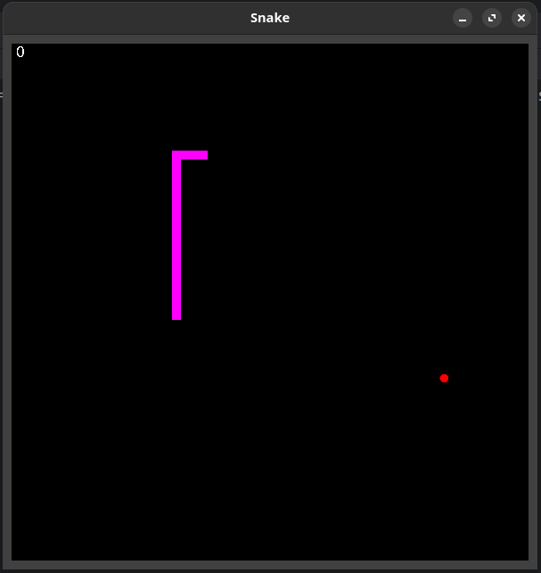

# Snake

## Summary
A simple snake game I wrote as a swing app in 2019 as a personal project when new to Java. I previously had a C#
background of around 15 years. The game has been tested on both a linux and a windows desktop. 

## Limitations:
* No sound
* Graphics is not hardware accelerated
* The canvas is a fix size of 600x600 due to the tile size of 10 pixel.
* Game window cannot be resized without causing issues.
* The game has no ending 
* There are only 3 different levels, and you progress to the next level after eating 10 apples.
* The speed does not increase
* The `Level` constructor is too large and has a rudimentary hard coded technique to create levels.
* No unit tests, this would be handy to test different collisions rather than relying on manual testing.

## Screenshot
